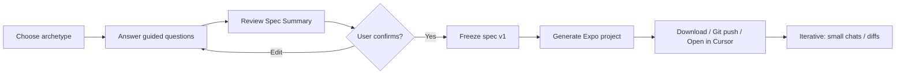

# REACTIVE — Product & Technical Plan

**Working name:** REACTIVE  
**One-liner:** Guided specification, then one-shot generation — an AI that interviews you first, then builds your Expo (React Native) app from a frozen spec so it does not guess your product.

---

## 1. Vision & positioning

| | |
|---|---|
| **What it is** | A product that collects requirements through a structured multi-step questionnaire, produces a canonical **App Spec**, then runs codegen against a proven **Expo template** — with optional iterative diffs after v1. |
| **What it is not** | A black-box “generate APK with no repo” tool; users own a normal Expo codebase. |
| **Differentiator vs generic AI IDEs** | RN/Expo-native defaults, navigation patterns, Safe Area / Platform conventions, and a **spec schema** that constrains the model. |

**Tagline options (for later):** *“Specify once. Ship React Native.”* / *“Your app, specified before it’s coded.”*

---

## 2. Competitive synthesis — what to steal

Public positioning from tools in the **AI → React Native / Expo** space (e.g. [Draftbit](https://draftbit.com/), [RapidNative](https://www.rapidnative.com/), [Fastshot](https://www.fastshot.ai/), [Create / Anything](https://www.create.xyz/), [Newly](https://natively.dev/), [Appify](https://appify-app.com/), [Appy Pie AI](https://appypievibe.ai/)). Below: patterns that are **worth adopting** in REACTIVE, mapped to **when** (MVP vs later).

### 2.1 Ownership & trust (high priority)

| Pattern | Where it shows up | Pull into REACTIVE |
|--------|-------------------|---------------------|
| **Real repo export** | ZIP + GitHub; “no lock-in” copy | **MVP:** downloadable Expo zip; **Phase 4:** Git push. |
| **Honest stack** | Expo + TypeScript called out explicitly | **MVP:** one documented stack per template (navigation + styling choice fixed). |
| **Generation notes** | Assumptions listed for hand-off | **MVP:** `GENERATION_NOTES.md` from spec + template (already planned). |

### 2.2 Build & runtime experience

| Pattern | Where it shows up | Pull into REACTIVE |
|--------|-------------------|---------------------|
| **Expo Go QR** | Nearly all RN builders | **MVP:** instructions + QR from user’s `expo start`; **later:** hosted preview if you add cloud dev servers. |
| **Isolated codegen environment** | Agents in cloud sandbox | **Phase 2+:** worker runs in container; reproducible builds, no bleed between users. |
| **Lint / typecheck gate** | Implied by “production-ready” positioning | **MVP:** fail delivery if `tsc` / ESLint fail on artifact. |
| **NativeWind or one styling system** | RapidNative (Tailwind-style RN) | **MVP:** pick **one** (e.g. NativeWind or StyleSheet + tokens) per template — consistency > choice. |

### 2.3 Product flow (closest to REACTIVE’s thesis)

| Pattern | Where it shows up | Pull into REACTIVE |
|--------|-------------------|---------------------|
| **Staged pipeline** | Describe → design / approve → build → ship (Fastshot-style) | **Core:** intake → **spec summary** → **freeze** → generate — you already own the strictest version of this. |
| **Plan mode** | Newly | **Same idea:** wizard + frozen spec = “plan” before code. |
| **Chat iteration after v1** | RapidNative, Draftbit, Create | **Post-freeze:** small prompts / diffs only (avoid full regen). |

### 2.4 AI workflow depth (medium priority, post-MVP)

| Pattern | Where it shows up | Pull into REACTIVE |
|--------|-------------------|---------------------|
| **Multiple models / agents** | Fastshot (multi-agent); Draftbit (switch models) | **Later:** separate passes — e.g. “layout” vs “copy” vs “wiring” — all reading the same App Spec. |
| **Runtime logs + “fix” loop** | Draftbit (logs, AI assist) | **Later:** paste Metro error → targeted patch against repo. |
| **Org / project defaults** | Shared agent instructions (Draftbit) | **Later:** `reactive.config` or spec-level **conventions** (naming, folder rules). |
| **Screenshot → input** | Create (“screenshot to app”) | **Later:** optional intake — image → draft spec sections, user still confirms before freeze. |

### 2.5 Backend, growth, and moat (explicitly later)

| Pattern | Where it shows up | Pull into REACTIVE |
|--------|-------------------|---------------------|
| **Managed Supabase + auth** | Fastshot, Newly, Appify | **Phase 4:** “Connect Supabase” wizard → env vars + stub client; no magic DB provisioning in MVP unless you want to. |
| **Monetization hooks** | Fastshot (subscriptions, ads) | **Park lot:** templates with Adapty / AdMob **placeholders** only. |
| **Store packaging** | Metadata, screenshots, submission assist | **Park lot:** generate **copy + checklist**, not auto-submit until compliance is solved. |
| **Full-stack in one product** | Create (DB, auth, payments, integrations) | **Strategic choice:** REACTIVE can stay **mobile-first + spec** and integrate with bring-your-own API — avoids competing on hosting breadth early. |
| **Expert / services layer** | Draftbit Experts | **Business:** optional human review of App Spec before build. |

### 2.6 What REACTIVE should **not** copy blindly

- **Single giant chat as the only intake** — weak specs; your differentiator is **structured questions → frozen spec**.
- **Unbounded dependency sprawl** — competitors promise “anything”; REACTIVE wins with **allowlisted packages** tied to spec.
- **Opaque “AI built it” with no export** — undermines trust; export stays core.

---

## 3. Target user & MVP scope

**Primary user (MVP):** Founder or indie dev who wants a **credible v1** (auth shell, main flows, consistent UI) without inventing architecture from a blank prompt.

**MVP must include:**

1. **Intake wizard** — branching questions by app “archetype” (e.g. content, utility, social-lite, marketplace-lite).
2. **Spec summary screen** — human-readable + editable checklist before any code runs.
3. **Canonical App Spec** — versioned JSON (see §6) stored per project.
4. **Code generation** — produces or patches an **Expo (TypeScript)** repo from template + spec.
5. **Single “Build” action** — one primary generation pass from confirmed spec (user feels like “one prompt” after intake).

**Explicitly out of MVP (park lot):**

- Visual drag-and-drop canvas (can be Phase 2).
- Custom native modules beyond what Expo supports without ejecting.
- Full backend provisioning (MVP: env placeholders + optional Supabase/Firebase stubs documented in spec).

---

## 4. Core user journey

**Principle:** Multi-question start exists so **generation is not under-specified**. After confirm, changes are **targeted diffs** against the frozen spec, not full rewrites.

---

## 5. System architecture (high level)

| Layer | Responsibility |
|--------|----------------|
| **Web app (or desktop shell)** | Wizard UI, spec editor, project list, “Build” trigger, status/logs. |
| **Spec service** | Validate intake → merge into App Spec JSON; version specs (`v1`, `v1.1`). |
| **Template repo** | Opinionated Expo TS app: navigation, theme, folders, lint, example screens. |
| **Codegen / AI worker** | Input: frozen spec + template; Output: file tree or unified diff; must respect `DO_NOT_TOUCH` boundaries. |
| **Artifact store** | Zip of repo, or link to user’s GitHub after OAuth (post-MVP). |
| **Secrets** | API keys for AI provider; user’s third-party keys only via env template, never hardcoded. |

**Hosting sketch (flexible):** Static/SSR frontend + serverless API + job queue for long codegen runs; artifacts in object storage.

---

## 6. App Spec (canonical contract)

Define a **versioned JSON schema** early. Everything else hangs off it.

**Suggested top-level sections:**

- `meta` — name, slug, archetype, spec version, created/updated.
- `audience` — one paragraph + primary persona (structured fields).
- `journeys` — ordered steps per flow (ids for traceability).
- `navigation` — graph: stacks, tabs, initial route, screen list.
- `screens[]` — id, title, purpose, key UI blocks (list/detail/form/settings).
- `data_model` — entities + fields + relationships (MVP can be minimal).
- `auth` — none / email / social (stubs only in MVP).
- `backend` — none / “bring your API” / Supabase-ready stub (flags only).
- `integrations` — push, maps, camera, payments (each on/off).
- `design` — theme: primary color, mode (light/dark/system), density, reference adjectives.
- `non_goals[]` — bullet list to block scope creep in codegen prompt.

**Rule:** The build prompt must say: *Implement only what is in `SPEC`; if something is missing, use the simplest Expo-supported placeholder and list assumptions in `GENERATION_NOTES.md`.*

---

## 7. Codegen strategy

| Approach | Pros | Cons |
|----------|------|------|
| **Full scaffold from template + patch** | Predictable structure, easier review | Larger initial template |
| **File-by-file with allowlist** | Safer edits | More orchestration |

**Recommendation for MVP:** **Template-first full scaffold** per archetype (2–3 templates max), then **patch** shared components (theme, navigation, screen files) from spec. Reduces “invented folder chaos.”

**Guardrails:**

- `TEMPLATE.md` in repo listing conventions.
- ESLint + TypeScript strict; CI script that runs `tsc` and `eslint` on generated output before user download.
- “No new dependencies” unless listed in allowlist (e.g. `react-navigation`, `expo-router` if chosen once).

---

## 8. Phased roadmap

| Phase | Focus | Deliverable |
|-------|--------|-------------|
| **0 — Spec only** | JSON schema + example specs + validator | No AI; proves contract |
| **1 — Wizard + fake build** | UI flows, summary, export spec JSON | Demo without codegen |
| **2 — Template + codegen v1** | One archetype, one template, AI fills screens | Downloadable Expo zip |
| **3 — Quality** | Lint gate, second archetype, GENERATION_NOTES | Fewer failed builds |
| **4 — Integrations** | Git push, optional Supabase stub, env wizard | Stickier product |
| **5 — Visual** | Live preview or simple layout tweaks | “No-code” feel |

**Roadmap lift from §2:** Phase 3–5 can add **multi-pass agents**, **logs→fix**, **screenshot→draft spec**, and **device-matrix preview** as bandwidth allows — without diluting spec-first positioning.

---

## 9. Risks & mitigations

| Risk | Mitigation |
|------|------------|
| Model invents features | Frozen spec + non_goals + summary confirmation |
| Unrunnable generated code | Template-first; CI on artifact before delivery |
| Users expect Cursor-in-the-browser | Position as **spec + codegen**; export to Cursor for iteration |
| Maintenance hell (many templates) | Few archetypes; shared core template with flags |

---

## 10. Success metrics (first 90 days)

- **Time to first downloadable zip** (median).
- **% builds passing `tsc` + lint** without manual fix.
- **Wizard completion rate** → **confirm spec** rate.
- **One-week retention:** user opened generated project or ran `expo start`.

---

## 11. Immediate next steps (this repo)

**Shipped (full local / Docker platform):**

- **Wizard:** `apps/web` — Vite UI; `npm run dev` or `npm run dev:platform` with API.
- **API:** `apps/api` — `POST /api/generate` returns **Expo ZIP** (includes `npm install` output).
- **Validate / codegen / quality:** `validate-spec.mjs`, `codegen.mjs`, `check-artifact.mjs` (tabs-only v1).
- **Optional AI:** `scripts/llm-enrich-spec.mjs` — polishes copy fields with OpenAI; still schema-valid.
- **Deploy:** `Dockerfile` (static UI + API); **GitHub Actions** CI — validate, build web, codegen smoke test.
- **Phase 5** (live in-browser RN preview): still deferred — use Expo Go or simulators.

**Optional later:** Git OAuth from the product, hosted zip CDN, multi-stack codegen (`stack` / `tabs-stack`), App Store pipeline.

---

*Document version: 0.5 — REACTIVE*
